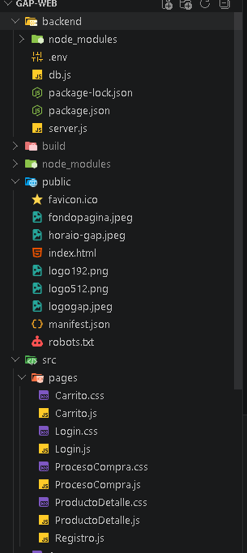

# Documentacion

La base del sistema reside en la conexión estable entre el servidor (Backend) y la base de datos. Para garantizar la seguridad y portabilidad, se configuró el archivo .env en la raíz del proyecto backend para almacenar las credenciales de acceso de la base de datos que se esta usando, Una vez establecida la conexión con la base de datos, se procedió a la integración de ambas capas de la aplicacion, se conecta el frontend y backend, para la conexion se puso el puerto de la base de datos en el 5000 y despues se configura el fronted poniendo el localhost 5000 que es el del backend hasi para que al estar usando el backend, en el frontend se pueda funciona inicio de sesion y ver los productos, se agrega el carrito y que el prducto se pueda agregar en el carrito, se agrega en el app.js el boton de agregar el pructo al carrito, para agregarlo se tendra que tener una cuenta para asir poder agregar el producto al carrto, se creo un archivo .js para la ventana del carrito en el cual uno podra elegir la cantidad del producto cuanto va a esta llevando y estaria cambiando el precio dependiendo de la cantidad, se agrega en el app.js el horario de la bodega y se agrega un video de instagram en el cul mestra la ubicacion de la bodega, se agrega la funcion de poder comprar los productos que se tenga en el carrito agregado, se crea el achvio .js para la ventana del pago de los productos, se pone el nombre, direccion, tarjeta de debito/credito, al completar el metodo de pago aparece que la compra se hizo correctamente y en la base se datos se muestra que baja el numero de stock del producto en el cual el usuario eligio para comprar en la pagina web.

---

---

---

---

---

---

---

---

